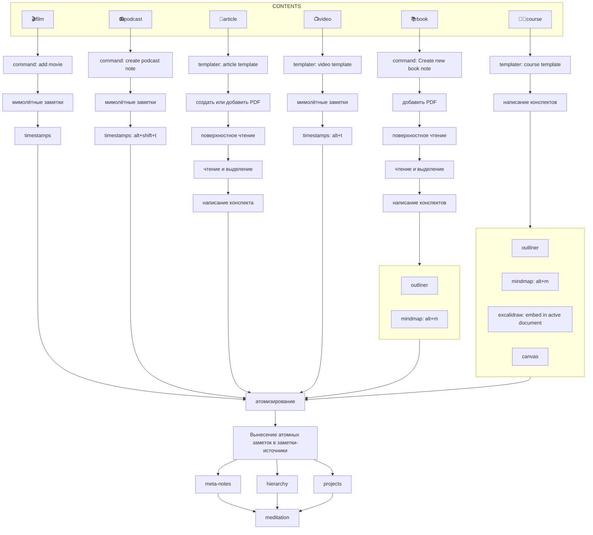

[mermaid help](https://mermaid-js.github.io/mermaid/#/flowchart)

```mermaid
flowchart TD
	subgraph CONTENTS
		book["📚book"]
		film["🎬film"]
		podcast["📻podcast"]
		article["🧾article"]
		video["📺video"]
		course["🧑‍🏫course"]
	end
	
	book --> book1["command: Create new book note"]
	book1 --> book2["добавить PDF"]
	book2 --> book3["поверхностное чтение"]
	book3 --> book4["чтение и выделение"]
	book4 --> book5["написание конспектов"]
	subgraph book6[" "]
		direction LR
		book61["outliner"]
		book62["mindmap: alt+m"]
	end
	book5 --> book6 --> atom["атомизирование"]
	film --> film1["command: add movie"]
	film1 --> film2["мимолётные заметки"]
	film2 --> film3["timestamps"]
	film3 --> atom["атомизирование"]
	
	podcast --> podcast1["command: create podcast note"]
	podcast1 --> podcast2["мимолётные заметки"]
	podcast2 --> podcast3["timestamps: alt+shift+t"]
	podcast3 --> atom
	
	article --> article1["templater: article template"]
	article1 --> article2["создать или добавить PDF"]
	article2 --> article3["поверхностное чтение"]
	article3 --> article4["чтение и выделение"]
	article4 --> article5["написание конспекта"]
	article5 --> atom
	
	video --> video1["templater: video template"]
	video1 --> video2["мимолётные заметки"]
	video2 --> video3["timestamps: alt+t"]
	video3 --> atom
	
	course --> course1["templater: course template"]
	course1 --> course2["написание конспектов"]
	subgraph course3[" "]
		direction LR
		course31["outliner"]
		course32["mindmap: alt+m"]
		course33["excalidraw: embed in actve document"]
		course34["canvas"]
	end	course2 --> course3
	course3 --> atom
	
	atom --> source["Вынесение атомных заметок в заметки-источники"]
	source --> meta-notes --> meditation
	source --> hierarchy --> meditation
	source --> projects --> meditation

```